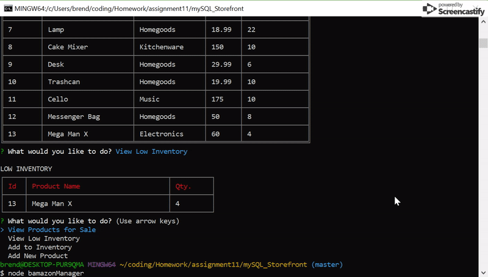

# mySQL_Storefront

Amazon-like app using Node and MySQL that allows users to buy products.

How it works ...

- Clone repo to your machine

- Create a .env file with the following code, and insert your password where it says "your password here."

    MYSQL_PW= { 'your password here' };

- Create database and tables in MySQL using the code in schema file

- npm install to install dependecies in the package.json file

Customer App
==================
Customers can view products for sale and are prompted to choose one to purchase. They are then asked to enter a quantity and if enough product is available, the transaction will be processed and the quantity will be deducted from the inventory.

- Enter "node bamazonCustomer" into the command line
- Follow the prompts to buy products

Manager App
===================
Managers have four options, to view products for sale, view only products with low inventory, add stock to a product, and add new products for sale.

- Enter "node bamazonManager" into the command line
- Follow the prompts to view products, view low inventory products, add stock, or add products

To do..
==================
- would still like to get the supervisor view working
